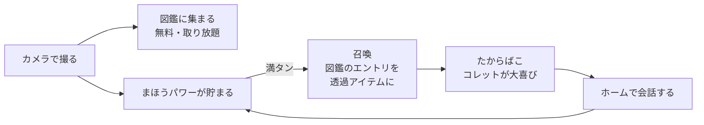
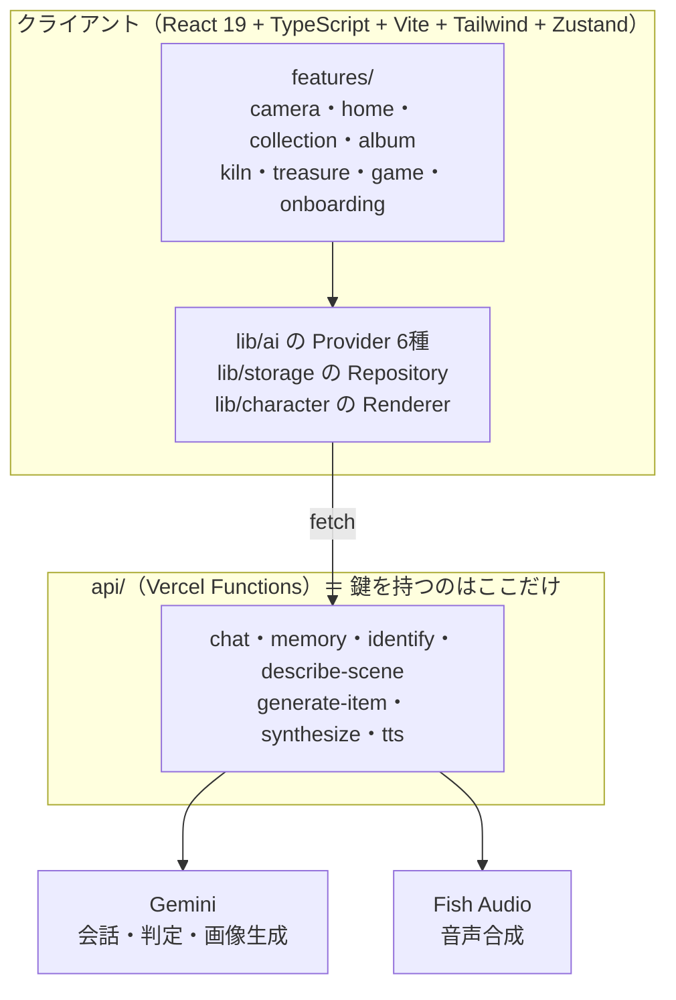

# えにこれ

**妖精の相棒コレットと、いつもの毎日を「ちょっと冒険」に変えるブラウザアプリ。**

現実のモノや景色をカメラで見せると、コレットが声つきで反応して図鑑に書き留める。
貯まった「まほうパワー」で図鑑のエントリを召喚し、コレットのたからばこに贈る。
家に帰れば、その日見つけたものの話ができる。

**[https://any-collect.vercel.app](https://any-collect.vercel.app)** — スマホのブラウザで開いてください（カメラを使うので実機推奨）。

> リポジトリ名は `any-collect`、プロダクト名は「えにこれ」です（名前は後から決まりました）。


---

## なにができるか

**2つのモードでできています。**

| モード | 役割 |
|---|---|
| **カメラ** | 世界をコレットに見せる。撮ると声つきで反応し、写真はアルバムへ、**写っている主役を判定して切り出したもの**は図鑑へ |
| **ホーム** | コレットとの**会話が主役**。図鑑・たからばこ・メニュー（窯／アルバム／ゲーム）の入口 |

コアループはこうです。



**図鑑は無料で取り放題／召喚だけがコストの高い経路**なので、そこにだけ「まほうパワー」という栓をかけています（判定は安い vision、召喚は画像生成で1回 ¥7）。

## 触ってみる

初回はコレットが案内します（**はじめまして → きみの世界に興味がある → 見せてほしい → カメラ**）。
そのまま何か1つ撮ると図鑑が開き、「ふたりで図鑑をいっぱいにしよう」まで一気に進みます。

- **音が出ます。**最初のタップまではブラウザの制約で無音です（[理由](DECISIONS.md)）
- URL に **`?debug=1`** を付けると検証用の操作が有効になります（なつきレベルの循環／まほうパワー満タン／記憶の手動要約／会話を1日前にする／全消去）。`?debug=0` で解除

## 設計で大事にしたこと

**① 背骨＝コレットの"欲"がユーザーを現実へ連れ出す**
反応するだけの相棒にしない。コレットの側から「見たい・行きたい」を言う。妖精界には乗りものも機械もほとんど無いので、**無いものほど人間界で見たがる**——という設定が、そのまま「外に出る理由」になっています。

**② 失敗をシステムの言葉で見せない**
生成が失敗しても「エラーが発生しました」とは出しません。コレットのセリフで受けます（[`failureLines.ts`](src/lib/character/failureLines.ts)）。原因の説明もUIの操作指示もさせない、というルールつき。彼女は妖精なので通信の概念を持っていません。

**③ キャラは差し替え単位**
[`src/characters/<id>/`](src/characters/default/) にペルソナ・立ち絵・声・背景・BGM がまとまっています。**新しいキャラを足すのはフォルダを1つ作ること**で、コードは触りません。口調は全AI呼び出し（会話・図鑑の判定コメント・アイテム名/説明・風景コメント）が同じ `persona.md` を読むので、モデルを跨いでも崩れません。

**④ 記憶を人質にしない**
写真は既定で端末ローカル。クラウド保存は opt-in。エクスポートと削除を一級機能として置く方針です（削除は「お別れ」として設計する）。

## アーキテクチャ



**原則は2つだけです。**

1. **シークレットをクライアントに出さない。**API キーを使う処理はすべて `api/` 経由。フロントから直接 Gemini / Fish Audio を叩きません。
2. **抽象化レイヤーを尊重する。**AI・キャラ表示・ストレージは必ずインターフェース越しに使います。差し替え点は以下：

| 差し替え点 | いま | 将来 |
|---|---|---|
| `ChatProvider` | Gemini | Claude（サーバ側で切替） |
| `ImageGenProvider` | Gemini 2.5 Flash Image | fal 等（実装済・既定オフ） |
| `SceneProvider` / `IdentifyProvider` / `MemoryProvider` | Gemini | 任意 |
| `TtsProvider` | Fish Audio | 任意 |
| `ItemRepository` / `PhotoRepository` / `CollectionRepository` | IndexedDB | Supabase |
| `CharacterRenderer` | 2D スプライト | Live2D / 3D |

### ディレクトリ

| パス | 役割 |
|---|---|
| `api/` | 外部API呼び出し（**鍵を使う処理は必ずここ**）。入力ガードは `_lib/http.ts` に集約 |
| `src/features/<機能>/` | 機能単位（camera / home / collection / album / kiln / treasure / game / onboarding） |
| `src/lib/ai/` | AI プロバイダの抽象化＝差し替え点 |
| `src/lib/character/` | キャラ表示の抽象化。待ち／失敗の in-character 文面もここ（**非コーダーが直接編集できる素のテキスト**） |
| `src/lib/storage/` | Repository パターン（IndexedDB ↔ Supabase を同じ抽象の裏に） |
| `src/characters/<id>/` | キャラ定義一式（persona / 立ち絵 / 声 / 背景 / BGM） |

## なぜそう作ったのか — [DECISIONS.md](DECISIONS.md)

このリポジトリでいちばん読む価値があるのは、たぶんコードではなく**判断の記録**です。
「いつ・何を・なぜ決めたか」と「**試して外した案**」を追記専用で残しています。たとえば：

- **レア度を全廃した**（LLM の主観に真値が無く、cozy な体験と噛み合わなかった）
- **召喚の出現演出を、作ったうえで不採用にした**（同じ絵を2回見せることになると実機で分かった）
- **「タップしてはじめる」起動画面を作らない**（ネイティブ化で消える制約のために、毎回1枚踏ませることになる）
- **好感度でコレットの口調を変えるのをやめた**（3段では気づけない。効く出口は口調ではなく目に見える解禁だった）
- **紙の質感は「入れたかどうか」でなく「知覚できる強さかどうか」**（コントラスト比 1.00 ＝存在していなかった）

ドキュメントは役割で分けています。**同じ事実を2か所に書かない**（重複は必ず片方が腐るので）。

| ファイル | 持っているもの |
|---|---|
| [spec.md](spec.md) | **いま何がどうなっているか**だけ（日付・旧仕様を書かない） |
| [DECISIONS.md](DECISIONS.md) | いつ・何を・なぜ決めたか／試して外した案 |
| [ROADMAP.md](ROADMAP.md) | STEP の状態だけ |
| [UI-NOTES.md](UI-NOTES.md) | まだ決着していない UI の宿題 |
| [CLAUDE.md](CLAUDE.md) | 開発規約（どう作るか） |

## セキュリティとプライバシー

- **API キーはサーバ側のみ。**クライアントに出るのは `VITE_SUPABASE_*`（公開前提の値）だけです。
- **写真は既定で端末ローカル**（IndexedDB）。クラウド保存は opt-in。PII は集めません（匿名前提・引き継ぎは opt-in）。
- **`api/` は無認証**です（認証の本体は Supabase 移行とセット）。**承知のうえ**で、守りを3層に分けています：
  - **層0＝プラットフォームの予算上限**（前払い残高／Vercel の Spend Management）。コード側の上限には必ず穴があるので、最終的な蓋はここ
  - **層1＝発信元オリジンの検査**（`rejectForeignOrigin`・全エンドポイント）。⚠️ Origin は偽装できるので**鍵ではありません**。素の直叩きを落とすところまで
  - **層2＝日次総量の上限は未実装**
- 入力ガードは共通化しています（ボディ/画像のサイズ上限・パストラバーサル対策・プロンプトに載る文字列の正規化・**エラー詳細を外に出さない**）。
- **ひとりあたりの回数制限は入れていません**（社内公開のため。理由と再検討トリガーは DECISIONS）。

## 開発

```bash
npm install
cp .env.example .env   # GEMINI_API_KEY と FISH_AUDIO_API_KEY を入れる
npm run dev
```

| コマンド | 何をするか |
|---|---|
| `npm run dev` | 開発サーバ（`api/` も Vite プラグインが同じコードで配信します） |
| `npm run build` | 型チェック＋本番ビルド |
| `npm run lint` | ESLint（**0 problems が基準**） |
| `npm test` | vitest（純関数のユニットテスト・99ケース） |
| `npm run sprites:optimize` | 立ち絵の WebP 化（png を足したら必ず実行） |
| `npm run voice:record` | 固定セリフの事前収録（台本を直したら実行） |
| `npm run bgm:optimize` | BGM のビットレート最適化 |

**実機確認は push → Vercel 経由で行います。**`dev --host` では IndexedDB が別オリジンになり、カメラも使えません（セキュアコンテキストが要る）。

## テスト

`npm test`（vitest・99ケース）。**網羅率は狙っていません。**対象を「**壊れても画面を見ただけでは気づけない場所**」に絞っています。

| 対象 | なぜここか |
|---|---|
| [`api/_lib/http.ts`](api/_lib/http.test.ts) | 入口のガード。**許可の側を間違えるとアプリ全体が 403 になる**ので、通す側と落とす側の両方を固定（前方一致で騙すドメイン・スキーム違いなど） |
| [`chatStore`](src/store/chatStore.test.ts) | 履歴の切り詰めは**未要約の会話を消すと二度と記憶に入らない**。再会の判定は数十分空けないと再現しない |
| [`affinityStore`](src/store/affinityStore.test.ts) | レベル曲線に上限が無いこと・進捗が 0..1 を突き抜けないこと |
| [`grounding`](src/lib/grounding.test.ts) | 毎回のリクエストに載るのに画面には出ない。壊れると同じ話を蒸し返す |
| [`category`](src/lib/category.test.ts) | AI が enum を外した値を返したときの最後の砦 |
| [`restingExpression`](src/lib/character/restingExpression.test.ts) | **深夜0〜4時にしか出ない**＝目視で守れない |

UI とストアの副作用は対象外です（壊れやすいテストは負債になるので、そこは実機の目視で見ています）。

## いまの状態

コアループ・会話・記憶・声・オンボーディング・たからばこまで動いています。
**未実装のものも隠さず書いておきます**：エクスポート／インポートが未実装、永続化はまだ端末ローカルのみ（Supabase 移行と通知は「毎日開く理由」を作るためにセットで着手する予定）、`api/` の日次総量上限が未実装。

進捗は [ROADMAP.md](ROADMAP.md) が正です。

---

<sub>個人開発 / React 19 + TypeScript + Vite + Tailwind + Zustand / Vercel Functions / Gemini・Fish Audio</sub>
