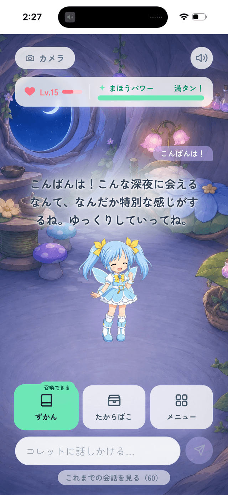
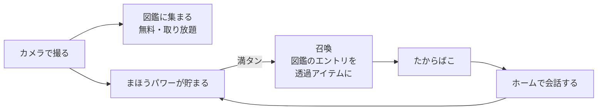

# えにこれ

妖精の相棒コレットと、いつもの毎日を「ちょっと冒険」に変えるブラウザアプリ。
現実のモノや景色をカメラで見せると、コレットが声つきで反応して図鑑に書き留める。
貯まった「まほうパワー」で図鑑のエントリを召喚し、コレットのたからばこに贈る。

**[https://any-collect.vercel.app](https://any-collect.vercel.app)** — カメラを使うのでスマホのブラウザ推奨。



> リポジトリ名は `any-collect`、プロダクト名は「えにこれ」。

## 機能

| モード | できること |
|---|---|
| **カメラ** | 撮るとコレットが声つきで反応。写真は**アルバム**へ、写っている主役を判定して切り出したものは**図鑑**へ |
| **ホーム** | コレットとの**会話**（記憶・時間帯・図鑑の傾向で話が変わる）。図鑑・たからばこ・メニューの入口 |



- **図鑑（判定＋クロップ）は無料で取り放題／召喚（画像生成）だけがコスト高**なので、そこにだけ「まほうパワー」の栓をかけている
- そのほか：**妖精の釜**（アイテム2つを合成）、**アルバム**（写真から会話に持ち込める）、ミニゲーム
- 声は**カメラ＝動的TTS／ホーム＝事前収録**（実行時ゼロ円）。BGM はシーンごとに差し替え

## アーキテクチャ


- **API キーはサーバ側のみ。**フロントから直接 Gemini / Fish Audio を叩かない
- **AI・キャラ表示・ストレージはインターフェース越し**に使う（下の差し替え点）
- 口調は全AI呼び出しが同じ `persona.md` を読む。**キャラの追加は `src/characters/<id>/` を足すだけ**

| 差し替え点 | いま | 将来 |
|---|---|---|
| `ChatProvider` | Gemini | Claude |
| `ImageGenProvider` | Gemini 2.5 Flash Image | fal 等 |
| `SceneProvider` / `IdentifyProvider` / `MemoryProvider` | Gemini | 任意 |
| `TtsProvider` | Fish Audio | 任意 |
| `ItemRepository` / `PhotoRepository` / `CollectionRepository` | IndexedDB | Supabase |
| `CharacterRenderer` | 2D スプライト | Live2D / 3D |

| パス | 役割 |
|---|---|
| `api/` | 外部API呼び出し（鍵を使う処理は必ずここ）。入力ガードは `_lib/http.ts` に集約 |
| `src/features/<機能>/` | 機能単位（camera / home / collection / album / cauldron / treasure / game / onboarding） |
| `src/lib/ai/` | AI プロバイダの抽象化＝差し替え点 |
| `src/lib/character/` | キャラ表示の抽象化。待ち／失敗の文面もここ |
| `src/lib/storage/` | Repository パターン（IndexedDB ↔ Supabase） |
| `src/characters/<id>/` | キャラ定義一式（persona / 立ち絵 / 声 / 背景 / BGM） |

## 開発

```bash
npm install
cp .env.example .env   # GEMINI_API_KEY と FISH_AUDIO_API_KEY を入れる
npm run dev
```

| コマンド | |
|---|---|
| `npm run dev` | 開発サーバ（`api/` も同じコードで配信される） |
| `npm run build` | 型チェック＋本番ビルド |
| `npm run lint` | ESLint |
| `npm test` | vitest（純関数のユニットテスト） |
| `npm run sprites:optimize` | 立ち絵の WebP 化 |
| `npm run voice:record` | 固定セリフの事前収録 |
| `npm run bgm:optimize` | BGM のビットレート最適化 |

実機確認は push → Vercel 経由（`dev --host` は IndexedDB が別オリジンになり、カメラも使えない）。
URL に `?debug=1` を付けると検証用の操作が有効になる。

## ドキュメント

| | |
|---|---|
| [spec.md](spec.md) | いま何がどうなっているか |
| [DECISIONS.md](DECISIONS.md) | いつ・何を・なぜ決めたか／試して外した案 |
| [ROADMAP.md](ROADMAP.md) | STEP の状態 |
| [UI-NOTES.md](UI-NOTES.md) | 未決着の UI の宿題 |
| [claude.md](claude.md) | 開発規約 |
